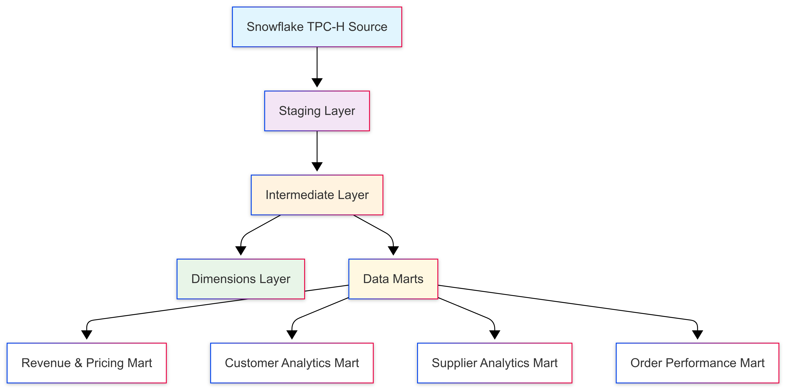
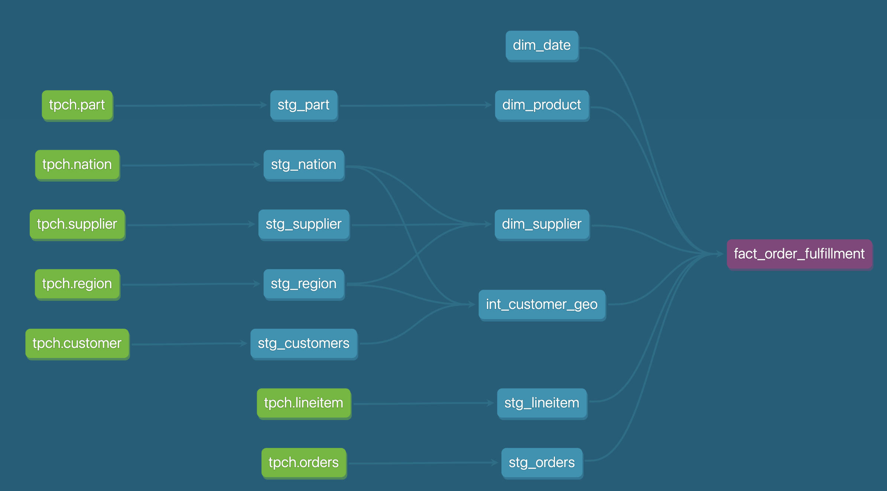
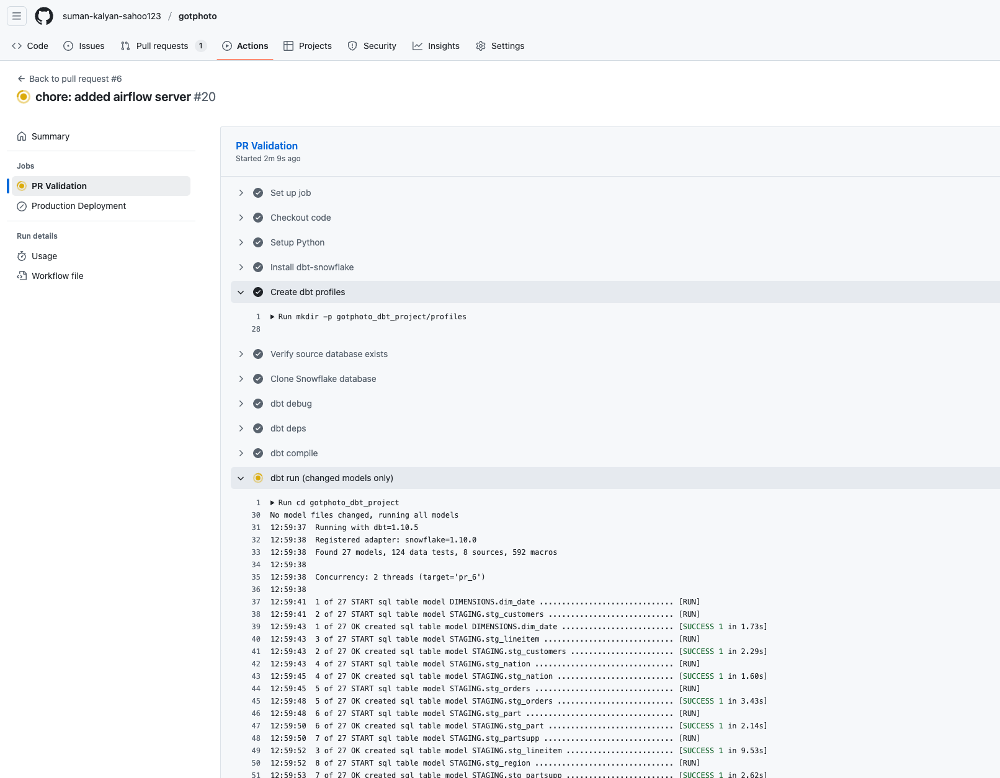
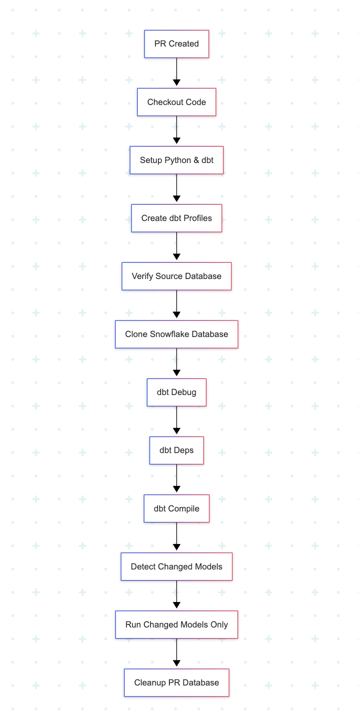
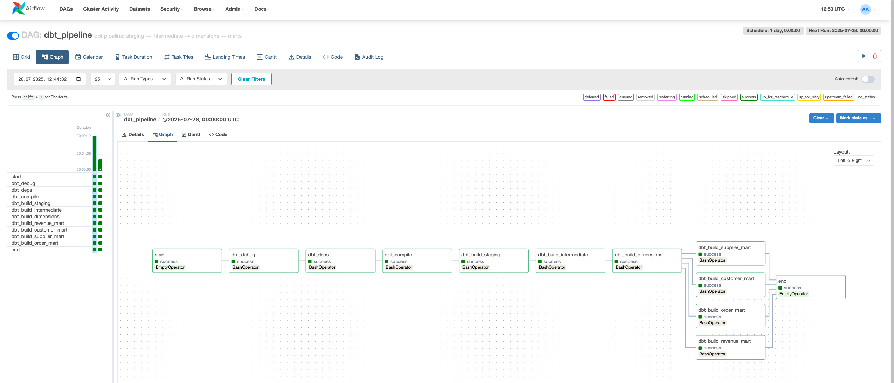
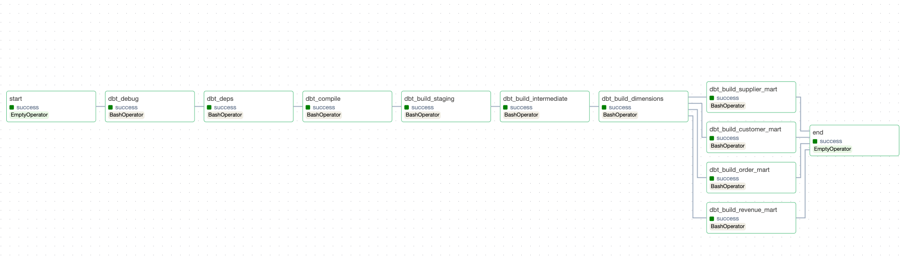

# 🏢 GotPhoto Home Assignment


A comprehensive data platform built with **dbt** (data build tool) that transforms TPC-H sample data from Snowflake into actionable business intelligence through multiple data marts focused on revenue analysis, customer analytics, supplier performance, and order fulfillment.


## 🎯 Project Overview

This dbt project implements a **multi-layered data architecture** that follows industry best practices for data modeling, transforming raw TPC-H data into business-ready analytics through:

- **4 Specialized Data Marts** for different business domains
- **Dimensional Modeling** with facts and dimensions
- **Python & SQL Models** demonstrating hybrid transformations
- **Comprehensive Data Quality** testing and validation
- **Customer Lifetime Value (CLV)** calculations using Python

### 🎯 Business Objectives

This platform delivers comprehensive analytics across key business domains:
- **Revenue & Pricing Analytics** - Profitability, margin analysis, and pricing optimization
- **Customer Intelligence** - Lifetime value, segmentation, and behavioral insights  
- **Supplier Performance** - Cost optimization, delivery tracking, and relationship management
- **Operational Excellence** - Order fulfillment, shipping efficiency, and process optimization
- **Advanced Analytics** - Python-powered predictive models and business intelligence

---

## 🏗️ Architecture

### 📊 **High-Level Architecture Flow**


*The diagram above shows the complete data flow from Snowflake TPC-H source data through our layered architecture to specialized data marts.*

### 🔄 **Detailed Architecture Diagram**



### 🏛️ Layered Architecture

| Layer | Purpose | Materialization | Schema |
|-------|---------|----------------|---------|
| **Staging** | Raw data cleaning & standardization | Table | `STAGING` |
| **Intermediate** | Business logic & joins | Table | `INTERMEDIATE` |
| **Dimensions** | Conformed dimensions | Table | `DIMENSIONS` |
| **Data Marts** | Business-specific analytics | Table | `*_MART` |

---

## 📊 Data Sources

### 🏪 Snowflake TPC-H Sample Data
**Source:** `SNOWFLAKE_SAMPLE_DATA.TPCH_SF1`

| Table | Records | Description |
|-------|---------|-------------|
| `CUSTOMER` | 150K | Customer master data |
| `ORDERS` | 1.5M | Order header information |
| `LINEITEM` | 6M | Order line items (detailed) |
| `PART` | 200K | Product/part master |
| `SUPPLIER` | 10K | Supplier information |
| `PARTSUPP` | 800K | Part-supplier relationships |
| `NATION` | 25 | Country reference |
| `REGION` | 5 | Regional groupings |

---

## 🔄 Data Flow




---

## 📁 Project Structure

```
gotphoto_dbt_project/
├── 📁 models/
│   ├── 📁 staging/              # Raw data standardization
│   │   ├── sources.yml          # Source definitions
│   │   ├── schema.yml           # Model documentation & tests
│   │   ├── stg_customers.sql
│   │   ├── stg_orders.sql
│   │   ├── stg_lineitem.sql
│   │   └── ... (8 staging models)
│   │
│   ├── 📁 intermediate/         # Business logic layer
│   │   ├── schema.yml
│   │   ├── int_lineitem_orders.sql
│   │   ├── int_product_supplier_cost.sql
│   │   ├── fact_line_pricing_analysis.sql
│   │   └── int_customer_geo.sql
│   │
│   ├── 📁 dimensions/           # Conformed dimensions
│   │   ├── schema.yml
│   │   ├── dim_customers.sql
│   │   ├── dim_product.sql
│   │   ├── dim_supplier.sql
│   │   ├── dim_geo.sql
│   │   └── dim_date.sql
│   │
│   └── 📁 marts/               # Business-specific data marts
│       ├── 📁 revenue_pricing/
│       │   ├── schema.yml
│       │   ├── fact_order_lines.sql
│       │   ├── fact_pricing_analysis.sql
│       │   └── fact_shipping_analysis.sql
│       │
│       ├── 📁 customer_analytics/
│       │   ├── schema.yml
│       │   ├── fact_customer_orders.sql
│       │   ├── fact_customer_summary.sql
│       │   └── customer_lifetime_value.py  # 🐍 Python Model
│       │
│       ├── 📁 supplier_analytics/
│       │   ├── schema.yml
│       │   ├── fact_supplier_performance.sql
│       │   └── fact_supplier_summary.sql
│       │
│       └── 📁 order_performance/
│           ├── schema.yml
│           ├── fact_order_fulfillment.sql
│           └── fact_order_summary.sql
│
├── 📁 profiles/                # dbt connection profiles
│   └── profiles.yml            # Snowflake connection config
│
├── 📁 macros/                  # Reusable SQL functions
├── 📁 tests/                   # Custom data tests
├── 📁 snapshots/              # SCD Type 2 tracking
│
├── 🐳 **Docker Files**
├── 📄 Dockerfile              # Container definition
├── 📄 docker-compose.yml      # Multi-container orchestration
├── 📄 Makefile                 # Build automation & task runner
│
├── 📄 dbt_project.yml         # Project configuration
├── 📄 packages.yml            # Package dependencies
└── 📄 README.md               # This file
```

---

## 🏪 Data Marts

### 💰 Revenue & Pricing Mart
**Schema:** `REVENUE_PRICING_MART`

| Model | Grain | Purpose |
|-------|-------|---------|
| `fact_order_lines` | Order Line | Detailed pricing analysis per line item |
| `fact_pricing_analysis` | Order Line | Pricing strategy and margin analysis |
| `fact_shipping_analysis` | Order Line | Shipping cost and delivery performance |

**Key Metrics:**
- Revenue, margin, and profitability analysis
- Pricing strategy optimization
- Shipping cost analysis
- Discount impact assessment

### 👥 Customer Analytics Mart
**Schema:** `CUSTOMER_ANALYTICS_MART`

| Model | Grain | Purpose |
|-------|-------|---------|
| `fact_customer_orders` | Order | Customer order behavior analysis |
| `fact_customer_summary` | Customer | Customer lifetime metrics |
| `customer_lifetime_value` | Customer | 🐍 **Python CLV Model** |

**Key Metrics:**
- Customer segmentation and tiering
- Lifetime value calculations
- Order frequency and patterns
- Customer health scoring

### 🏭 Supplier Analytics Mart
**Schema:** `SUPPLIER_ANALYTICS_MART`

| Model | Grain | Purpose |
|-------|-------|---------|
| `fact_supplier_performance` | Line Item | Supplier delivery and quality metrics |
| `fact_supplier_summary` | Supplier | Supplier performance summary |

**Key Metrics:**
- Supplier performance scoring
- Cost analysis and optimization
- Delivery reliability tracking
- Supplier relationship management

### 📦 Order Performance Mart
**Schema:** `ORDER_PERFORMANCE_MART`

| Model | Grain | Purpose |
|-------|-------|---------|
| `fact_order_fulfillment` | Line Item | Detailed fulfillment tracking |
| `fact_order_summary` | Order | Order-level performance metrics |

**Key Metrics:**
- Order fulfillment efficiency
- Delivery performance tracking
- Operational KPIs
- Process optimization insights

---

## 🐍 Python Models

### 🎯 Customer Lifetime Value (CLV) Model
**File:** `models/marts/customer_analytics/customer_lifetime_value.py`

A sophisticated Python model using **Snowflake Snowpark** that calculates comprehensive CLV metrics:

#### 📊 Model Features
- **Customer Aggregations:** Revenue, order count, AOV
- **CLV Calculation:** `AOV × Orders/Year × Projection Period`
- **Segmentation:** Bronze/Silver/Gold/Platinum tiers
- **Business Flags:** High-value, frequent, high-AOV customers
- **Profitability:** Estimated profit and margin analysis

## 🧪 Data Quality

### 🔍 Testing Strategy

| Test Type | Implementation | Coverage |
|-----------|----------------|----------|
| **Uniqueness** | `unique` & `dbt_utils.unique_combination_of_columns` | All primary keys |
| **Referential Integrity** | `not_null` | All foreign keys |
| **Data Freshness** | Source freshness checks | All source tables |
| **Custom Business Rules** | Custom tests | Business logic validation |

### 📊 Test Coverage
- **124 data tests** across all models
- **100% primary key** uniqueness validation
- **Complete referential integrity** testing
- **Business rule validation** for calculated fields

### 🛡️ Data Quality Framework
```yaml
# Example test configuration
models:
  - name: fact_customer_orders
    tests:
      - unique:
          column_name: customer_order_fact_key
          config:
            alias: unique_customer_order_fact_key
    columns:
      - name: customer_key
        tests:
          - not_null
      - name: total_net_revenue
        tests:
          - not_null
          - dbt_utils.accepted_range:
              min_value: 0
```

---

## ⚙️ Configuration

### 📋 dbt Project Configuration
**File:** `dbt_project.yml`

```yaml
models:
  gotphoto_dbt_project:
    staging:
      +materialized: table
      +schema: staging
      +persist_docs:
        relation: true
        columns: true
    
    intermediate:
      +materialized: table
      +schema: intermediate
    
    dimensions:
      +materialized: table
      +schema: dimensions
    
    marts:
      revenue_pricing:
        +materialized: table
        +schema: revenue_pricing_mart
      
      customer_analytics:
        +materialized: table
        +schema: customer_analytics_mart
      
      supplier_analytics:
        +materialized: table
        +schema: supplier_analytics_mart
      
      order_performance:
        +materialized: table
        +schema: order_performance_mart
```

### 📦 Package Dependencies
**File:** `packages.yml`

```yaml
packages:
  - package: dbt-labs/dbt_utils
    version: 1.1.1
```

## ❄️ Snowflake Environment Setup

Before running the dbt project, you need to set up your Snowflake environment with the required database, schemas, user, role, and warehouse.

### 🔧 **Run the following SQL commands in Snowflake:**

```sql
-- Create the main database
CREATE DATABASE GOTPHOTO_ANALYTICS_DB;

-- Create base schemas
CREATE SCHEMA STAGING;
CREATE SCHEMA INTERMEDIATE;

-- Use ACCOUNTADMIN role for user and role creation
USE ROLE ACCOUNTADMIN;

-- Create ETL user
CREATE USER gotphoto_etl_user
  PASSWORD = '******'  -- Replace with your secure password
  DISPLAY_NAME = 'GotPhoto ETL User'
  MUST_CHANGE_PASSWORD = FALSE;

-- Create ETL role
CREATE ROLE gotphoto_etl_role;

-- Grant role to user
GRANT ROLE gotphoto_etl_role TO USER gotphoto_etl_user;

-- Grant database privileges
GRANT USAGE, CREATE SCHEMA ON DATABASE GOTPHOTO_ANALYTICS_DB TO ROLE gotphoto_etl_role;

-- Grant schema privileges (existing and future)
GRANT ALL PRIVILEGES ON ALL SCHEMAS IN DATABASE GOTPHOTO_ANALYTICS_DB TO ROLE gotphoto_etl_role;
GRANT ALL PRIVILEGES ON FUTURE SCHEMAS IN DATABASE GOTPHOTO_ANALYTICS_DB TO ROLE gotphoto_etl_role;

-- Grant table privileges (existing and future)
GRANT ALL PRIVILEGES ON ALL TABLES IN DATABASE GOTPHOTO_ANALYTICS_DB TO ROLE gotphoto_etl_role;
GRANT ALL PRIVILEGES ON FUTURE TABLES IN DATABASE GOTPHOTO_ANALYTICS_DB TO ROLE gotphoto_etl_role;

-- Create warehouse
CREATE WAREHOUSE GOTPHOTO_WH
  WITH WAREHOUSE_SIZE = 'SMALL'
  AUTO_SUSPEND = 300
  AUTO_RESUME = TRUE
  INITIALLY_SUSPENDED = TRUE
  COMMENT = 'Warehouse for GotPhoto ETL processing';

-- Grant warehouse usage
GRANT USAGE ON WAREHOUSE GOTPHOTO_WH TO ROLE gotphoto_etl_role;
```

### ✅ **Verification**

After running the setup commands, verify your environment:

```sql
-- Switch to the ETL role
USE ROLE gotphoto_etl_role;
USE WAREHOUSE GOTPHOTO_WH;
USE DATABASE GOTPHOTO_ANALYTICS_DB;

-- Test access to sample data
SELECT COUNT(*) FROM SNOWFLAKE_SAMPLE_DATA.TPCH_SF1.CUSTOMER;
```

## 🚀 Getting Started

### 📋 **Prerequisites**

Before starting, ensure you have the following installed:

| Tool | Required | Download Link |
|------|----------|---------------|
| **Docker Desktop** | ✅ Yes | [Download Docker Desktop](https://www.docker.com/products/docker-desktop/) |
| **Make** | ✅ Yes | [Install Make](https://www.gnu.org/software/make/) |
| **Git** | ✅ Yes | [Download Git](https://git-scm.com/downloads) |
| **Snowflake Account** | ✅ Yes | [Snowflake Trial](https://trial.snowflake.com/) |

#### **Platform-Specific Installation:**

**Windows:**
```bash
# Install Docker Desktop from the link above
# Install Make via Chocolatey
choco install make

# Or install via Windows Subsystem for Linux (WSL)
wsl --install
```

**macOS:**
```bash
# Install Docker Desktop from the link above
# Make is included with Xcode Command Line Tools
xcode-select --install

# Or install via Homebrew
brew install make
```

**Linux:**
```bash
# Install Docker
curl -fsSL https://get.docker.com -o get-docker.sh
sh get-docker.sh

# Install Make (usually pre-installed)
sudo apt-get install make  # Ubuntu/Debian
sudo yum install make      # CentOS/RHEL
```

### 🐳 **Docker Setup (Simple)**

#### **1. Clone & Configure**
```bash
git clone <repository-url>
cd gotphoto_dbt_project
```

Configure your Snowflake connection in `profiles/profiles.yml`:
```yaml
gotphoto_dbt_project:
  target: dev
  outputs:
    dev:
      type: snowflake
      account: your_account
      user: your_username
      password: your_password
      role: your_role
      database: GOTPHOTO_ANALYTICS_DB
      warehouse: COMPUTE_WH
      schema: dbt_dev
      threads: 4
```

#### **2. Start Docker Container**
```bash
# Start container and enter interactive session
make dbt-start
```

#### **3. Run dbt Commands**
Inside the container, run any dbt commands:
```bash
dbt debug          # Test connection
dbt deps           # Install packages
dbt run            # Build all models
dbt test           # Run all tests
dbt docs generate  # Generate documentation
dbt docs serve     # Serve documentation
```

#### **4. Stop Container**
```bash
# Stop the container (from host terminal)
make dbt-stop
```

### 🎯 Selective Builds

```bash
# Build specific marts
dbt run --select marts.revenue_pricing
dbt run --select marts.customer_analytics

# Build Python models only
dbt run --select customer_lifetime_value

# Build with downstream dependencies
dbt run --select +fact_customer_orders+

# Build changed models only
dbt run --select state:modified+
```
---

### 🚀 **Generate & Serve Documentation**

#### **1. Generate Documentation**
```bash
# Generate static documentation files
dbt docs generate
```

#### **2. Serve Documentation**
```bash
# Start the documentation server
dbt docs serve --host 0.0.0.0 --port 8080
```

#### **3. Access Documentation**
Open your browser and navigate to:
```
http://localhost:8080
```

### 📊 **Documentation Persistence**

**🔗 Snowflake Integration**: All model and column documentation has been automatically persisted to Snowflake using `persist_docs` configuration in `dbt_project.yml`. This means:

- **📋 Table Comments**: Model descriptions appear as table comments in Snowflake
- **📝 Column Comments**: Column descriptions are visible in Snowflake UI and query results
- **🔍 Metadata Access**: Documentation is available directly in Snowflake without needing dbt docs
- **📊 Business Context**: Business users can see field descriptions when exploring data in Snowflake

**Example**: When you query `REVENUE_PRICING_MART.fact_order_lines` in Snowflake, you'll see the table and column descriptions directly in the Snowflake interface.

### 📊 **Documentation Features**

#### **🏗️ Lineage Graph**
- **Visual Dependencies**: See how models connect and depend on each other
- **Layer Navigation**: Explore staging → intermediate → dimensions → marts
- **Impact Analysis**: Understand downstream effects of model changes

#### **📋 Model Documentation**
- **Business Context**: Purpose and use cases for each model
- **Column Definitions**: Detailed descriptions of all fields
- **Data Quality**: Test results and validation status
- **Performance Metrics**: Run times and resource consumption

#### **🔍 Data Quality Dashboard**
- **Test Coverage**: Overview of all data quality tests
- **Test Results**: Pass/fail status and error details
- **Custom Tests**: Business rule validation results

#### **📈 Source Monitoring**
- **Freshness Checks**: Data freshness status and alerts
- **Source Documentation**: External data source definitions
- **Access Patterns**: How source data is consumed

### 🎯 **Documentation Best Practices**

#### **📝 Model Documentation**
```yaml
# Example model documentation in schema.yml
models:
  - name: fact_customer_orders
    description: "Customer order-level fact table for customer analytics"
    columns:
      - name: customer_key
        description: "Foreign key to customer dimension"
        tests:
          - not_null
          - relationships:
              to: ref('dim_customers')
              field: customer_key
```

#### **🔗 Lineage Documentation**
- Document upstream and downstream dependencies
- Explain business logic and transformations
- Note any special considerations or edge cases

#### **📊 Data Quality Documentation**
- Document test purposes and business rules
- Explain custom test logic and thresholds
- Track test coverage and gaps

### 🛠️ **Troubleshooting Documentation**

#### **Common Issues:**
```bash
# Port already in use
dbt docs serve --port 8081

# Host binding issues
dbt docs serve --host 0.0.0.0 --port 8080

# Documentation not updating
dbt docs generate --force
```

#### **Docker-Specific:**
```bash
# Access docs from host machine
docker exec -it dbt-cli dbt docs serve --host 0.0.0.0 --port 8080

# Check if docs server is running
docker exec dbt-cli ps aux | grep dbt
```

---

## 🚀 CI/CD Pipeline

### **How It Works**





**What happens:**
1. **Checkout Code**: Gets latest code from PR branch
2. **Setup Python & dbt**: Installs dbt and dependencies
3. **Create dbt Profiles**: Generates profiles.yml with PR-specific config
4. **Verify Source Database**: Checks if source database exists
5. **Clone Snowflake Database**: Creates `GOTPHOTO_ANALYTICS_DB_PR_<PR_NUMBER>`
6. **dbt Debug**: Validates connection and configuration
7. **dbt Deps**: Installs dbt packages
8. **dbt Compile**: Compiles all models to check syntax
9. **Detect Changed Models**: Uses `git diff` to find changed `.sql` files
10. **Run Changed Models Only**: Executes only modified models
11. **Cleanup PR Database**: Deletes PR database after validation

**Production Deployment:**
1. **Checkout Code**: Gets latest code from main branch
2. **Setup Python & dbt**: Installs dbt and dependencies
3. **Create dbt Profiles**: Generates profiles.yml with production config
4. **dbt Debug**: Validates connection and configuration
5. **dbt Deps**: Installs dbt packages
6. **dbt Compile**: Compiles all models to check syntax
7. **Full-Refresh All Models**: Runs all models with `--full-refresh`
8. **Deploy to Production Schema**: Updates models in production schema
9. **Run All Tests**: Executes all dbt tests

### **Key Features**
- ✅ **Database Cloning**: Each PR gets isolated environment
- ✅ **Smart Detection**: Only runs changed models (PR) vs all models (merge)
- ✅ **Automatic Cleanup**: PR databases deleted after validation
- ✅ **Fast Execution**: 2-5 min for PR validation

### **Troubleshooting**

| Issue | Solution |
|-------|----------|
| Workflow not triggering | Check changes are in `gotphoto_dbt_project/**` |
| Database clone fails | Grant `CREATE DATABASE ON ACCOUNT` permission |
| Permission denied on tables | Grant `CREATE TABLE ON SCHEMA` permission |
| Profiles not found | Use `--profiles-dir profiles` flag |
| SQL syntax errors | Remove Git merge conflict markers |

---

## 🚀 Apache Airflow Orchestration





### 🏗️ **DAG Structure**

The `dbt_pipeline` DAG orchestrates the complete data transformation:

| Task | Purpose | Dependencies |
|------|---------|--------------|
| `dbt_debug` | Validate connection & config | None |
| `dbt_deps` | Install dbt packages | `dbt_debug` |
| `dbt_build_staging` | Build staging models | `dbt_deps` |
| `dbt_build_intermediate` | Build intermediate models | `dbt_build_staging` |
| `dbt_build_dimensions` | Build dimension models | `dbt_build_intermediate` |
| `dbt_build_marts` | Build all mart models in parallel | `dbt_build_dimensions` |

### 🚀 **Getting Started with Airflow**

#### **1. Navigate to Airflow Directory**
```bash
cd gotphoto/infra_setup/airflow
```

#### **2. Environment Setup**
Create a `.env` file with your Snowflake credentials:
```bash
# Create environment file
cp env.snowflake.example .env

# Edit with your actual credentials
SNOWFLAKE_PASSWORD=your_actual_password
```

#### **3. Start Airflow**
```bash
# Start all Airflow services
make airflow-up
```

#### **4. Access Airflow UI**
Open your browser and navigate to:
```
http://localhost:8081
```
**Credentials:** `airflow` / `airflow`

#### **5. Monitor DAGs**
```bash
# List all available DAGs
make list-dags
```

#### **6. Stop Airflow**
```bash
# Stop all Airflow services
make airflow-down
```

### 🛠️ **Available Commands**

| Command | Purpose | Usage |
|---------|---------|-------|
| `make airflow-up` | Start all Airflow services | `make airflow-up` |
| `make airflow-down` | Stop all Airflow services | `make airflow-down` |
| `make list-dags` | List available DAGs | `make list-dags` |

### 🔧 **DAG Features**

#### **🔄 Parallel Execution**
- **Staging → Intermediate → Dimensions → Marts**: Sequential execution
- **Mart Models**: Parallel execution for faster completion
- **Resource Optimization**: Controlled concurrency limits


```


## 📈 Usage Examples

### 💡 Business Intelligence Queries

#### 🏆 Top Customers by CLV
```sql
SELECT 
    customer_key,
    simple_clv,
    customer_tier,
    value_category,
    total_revenue,
    total_orders
FROM CUSTOMER_ANALYTICS_MART.customer_lifetime_value
WHERE customer_tier = 'Platinum'
ORDER BY simple_clv DESC
LIMIT 10;
```

#### 📊 Revenue Analysis by Product
```sql
SELECT 
    part_name,
    SUM(net_revenue) as total_revenue,
    AVG(margin) as avg_margin,
    COUNT(DISTINCT customer_key) as unique_customers
FROM REVENUE_PRICING_MART.fact_order_lines
GROUP BY part_name
ORDER BY total_revenue DESC
LIMIT 10;
```

#### 🚚 Supplier Performance Dashboard
```sql
SELECT 
    supplier_name,
    total_orders,
    total_net_revenue,
    unique_customers_served,
    supplier_return_rate,
    supplier_nation
FROM SUPPLIER_ANALYTICS_MART.fact_supplier_summary
WHERE total_orders > 10
ORDER BY total_net_revenue DESC
LIMIT 10;
```

#### 📦 Order Fulfillment Metrics
```sql
SELECT 
    volume_category,
    AVG(order_to_first_ship_days) as avg_fulfillment_days,
    AVG(first_ship_to_receipt_days) as avg_shipping_days,
    COUNT(*) as order_count,
    AVG(order_return_rate) as avg_return_rate
FROM ORDER_PERFORMANCE_MART.fact_order_summary
GROUP BY volume_category
ORDER BY avg_fulfillment_days;
```